# OROD — Autonomous Refactoring and Code Security Team


-000000)


OROD is a local-first, multi-agent LangGraph application that inspects a Python
repository, consolidates the security findings from several scanners, writes a fix,
proves the fix in validation and, only after your approval, opens a **draft** pull request.

Everything runs on your machine: the model is served by Ollama, state lives in SQLite,
and advisory context is cached in Chroma. OROD never merges, never force-pushes and
never passes model output to a shell.

- **Deterministic detection.** Bandit, Ruff, Semgrep and a built-in Python scanner find
  code issues; dependencies are matched against OSV by exact package and version.
  Embeddings only pick advisory context for prompts; they never decide whether a package
  is vulnerable.
- **Patches from structured edits.** The model returns search/replace edits, not diffs.
  OROD applies them to the real workspace files and renders the diff itself, so each
  proposal passes the same path, size and file-type checks.
- **Validation compared with the base revision.** compileall, Ruff and pytest run before
  and after the patch. A patch fails only if it breaks something that worked before, or
  adds a high or critical finding.
- **A human decides.** The graph pauses before publishing. You approve, reject or ask for
  a new patch with feedback, and approval is refused for any patch that did not pass validation.
- **Measured, not assumed.** A corpus of 20 controlled vulnerability cases goes through
  the real pipeline, and CI fails if the deterministic result gets worse.

## How a run works

| Stage | Agent | What it does |
|---|---|---|
| 1 | **Architect** | Clones or prepares the repository, builds a file inventory and stops a repository that contains no Python. |
| 2 | **Security** | Runs the code scanners and OSV, deduplicates findings and records any scanner that failed, so a partial scan never reads as "all clear". |
| 3 | **Developer** | Picks the findings to fix, tries a deterministic codemod when one covers them all, otherwise asks the configured model for structured edits. |
| 4 | **Validator** | Runs the checks on the base revision and on the patch, rescans for new high or critical findings and asks the developer for a repair when needed. |
| 5 | **Reviewer** | Pauses for your decision when `OROD_REQUIRE_HUMAN_APPROVAL` is set: approve, reject or regenerate with feedback. |
| 6 | **Publish** | Commits only if the working tree still matches the validated diff exactly, then opens a draft PR through GitHub CLI. |

Every attempt, whether a repair or a regeneration, starts again from the base revision.
The stored diff is always one attempt, and the PR contains exactly what was validated.

## Architecture

The code follows a ports-and-adapters layout. Dependencies point
`API -> Application -> Domain/Ports <- Adapters`, and each agent is an `AgentPlugin` that
returns a LangGraph subgraph.

```mermaid
flowchart TD

subgraph group_dashboard["Dashboard"]
  node_dashboard_app["Dashboard<br/>[App.tsx]"]
  node_api_client["API client<br/>[client.ts]"]
  node_run_hook["Run lifecycle<br/>[useRun.ts]"]
  node_replay["Event replay<br/>[useReplay.ts]"]
end

subgraph group_api["API and runs"]
  node_runs_api["Run routes<br/>[runs.py]"]
  node_coordinator["Run coordinator<br/>[run_analysis.py]"]
  node_event_stream["Event streaming<br/>[stream_events.py]"]
  node_vulnerability_sync["Advisory sync"]
end

subgraph group_workflow["Agent workflow"]
  node_team_graph["Security team graph<br/>[builder.py]"]
  node_repository_stage["Repository survey<br/>[__init__.py]"]
  node_security_stage["Security analysis<br/>[__init__.py]"]
  node_finding_selection["Finding selection<br/>[routing.py]"]
  node_developer_stage["Patch development<br/>[__init__.py]"]
  node_validation_stage["Patch validation"]
  node_review_stage["Human review<br/>[routing.py]"]
  node_publish_stage["Draft PR publishing<br/>[cli.py]"]
end

subgraph group_integrations["Repository and security"]
  node_repository_adapter["Git repository<br/>[git.py]"]
  node_scanner_adapters["Security scanners"]
  node_llm_routing["Patch providers<br/>[routing.py]"]
  node_osv_adapter["OSV advisories<br/>[osv.py]"]
end

subgraph group_state["Run and advisory state"]
  node_run_store[("Run event store<br/>[sqlite.py]")]
  node_storage_ports["Storage contracts<br/>[storage.py]"]
  node_advisory_store[("Advisory index<br/>[chroma.py]")]
end

node_user(("User"))
node_github_service["GitHub"]
node_model_service["LLM service"]
node_docker_service["Docker validation"]

node_user -->|"starts and reviews"| node_dashboard_app
node_dashboard_app -->|"controls run"| node_run_hook
node_run_hook -->|"requests run"| node_api_client
node_api_client -->|"calls API"| node_runs_api
node_runs_api -->|"coordinates"| node_coordinator
node_coordinator -->|"runs workflow"| node_team_graph
node_team_graph -->|"surveys repository"| node_repository_stage
node_team_graph -->|"runs security analysis"| node_security_stage
node_security_stage -->|"returns findings"| node_finding_selection
node_finding_selection -->|"routes selected findings"| node_developer_stage
node_team_graph -->|"proposes fixes"| node_developer_stage
node_developer_stage -->|"validates patch"| node_validation_stage
node_validation_stage -->|"routes outcome"| node_review_stage
node_review_stage -->|"requests regeneration"| node_developer_stage
node_review_stage -->|"approves validated patch"| node_publish_stage
node_repository_stage -->|"prepares repository"| node_repository_adapter
node_security_stage -->|"runs scanners"| node_scanner_adapters
node_developer_stage -->|"requests patch"| node_llm_routing
node_llm_routing -.->|"requests generation"| node_model_service
node_validation_stage -->|"validates changes"| node_repository_adapter
node_repository_adapter -->|"clones repository"| node_github_service
node_validation_stage -.->|"runs trusted tests"| node_docker_service
node_publish_stage -.->|"opens draft PR"| node_github_service
node_coordinator -->|"persists run"| node_run_store
node_team_graph -->|"records events"| node_run_store
node_run_hook -->|"subscribes to events"| node_event_stream
node_event_stream -->|"reads event history"| node_run_store
node_run_hook -->|"replays events"| node_replay
node_vulnerability_sync -->|"fetches advisories"| node_osv_adapter
node_osv_adapter -->|"indexes advisories"| node_advisory_store
node_team_graph -->|"searches advisories"| node_advisory_store

click node_dashboard_app "https://github.com/omercn1/orod-security-lab/blob/main/frontend/src/App.tsx"
click node_api_client "https://github.com/omercn1/orod-security-lab/blob/main/frontend/src/api/client.ts"
click node_run_hook "https://github.com/omercn1/orod-security-lab/blob/main/frontend/src/features/runs/useRun.ts"
click node_replay "https://github.com/omercn1/orod-security-lab/blob/main/frontend/src/features/runs/useReplay.ts"
click node_runs_api "https://github.com/omercn1/orod-security-lab/blob/main/backend/src/orod/api/routes/runs.py"
click node_coordinator "https://github.com/omercn1/orod-security-lab/blob/main/backend/src/orod/application/run_analysis.py"
click node_event_stream "https://github.com/omercn1/orod-security-lab/blob/main/backend/src/orod/application/stream_events.py"
click node_team_graph "https://github.com/omercn1/orod-security-lab/blob/main/backend/src/orod/graph/builder.py"
click node_repository_stage "https://github.com/omercn1/orod-security-lab/blob/main/backend/src/orod/agents/architect/__init__.py"
click node_security_stage "https://github.com/omercn1/orod-security-lab/blob/main/backend/src/orod/agents/security/__init__.py"
click node_finding_selection "https://github.com/omercn1/orod-security-lab/blob/main/backend/src/orod/graph/routing.py"
click node_developer_stage "https://github.com/omercn1/orod-security-lab/blob/main/backend/src/orod/agents/developer/__init__.py"
click node_validation_stage "https://github.com/omercn1/orod-security-lab/blob/main/backend/src/orod/adapters/repository/validation_checks.py"
click node_review_stage "https://github.com/omercn1/orod-security-lab/blob/main/backend/src/orod/graph/routing.py"
click node_publish_stage "https://github.com/omercn1/orod-security-lab/blob/main/backend/src/orod/adapters/github/cli.py"
click node_repository_adapter "https://github.com/omercn1/orod-security-lab/blob/main/backend/src/orod/adapters/repository/git.py"
click node_scanner_adapters "https://github.com/omercn1/orod-security-lab/tree/main/backend/src/orod/adapters/scanners"
click node_llm_routing "https://github.com/omercn1/orod-security-lab/blob/main/backend/src/orod/adapters/llm/routing.py"
click node_osv_adapter "https://github.com/omercn1/orod-security-lab/blob/main/backend/src/orod/adapters/scanners/osv.py"
click node_run_store "https://github.com/omercn1/orod-security-lab/blob/main/backend/src/orod/adapters/persistence/sqlite.py"
click node_storage_ports "https://github.com/omercn1/orod-security-lab/blob/main/backend/src/orod/ports/storage.py"
click node_advisory_store "https://github.com/omercn1/orod-security-lab/blob/main/backend/src/orod/adapters/vector/chroma.py"
click node_vulnerability_sync "https://github.com/omercn1/orod-security-lab/blob/main/backend/src/orod/application/sync_vulnerabilities.py"

classDef toneNeutral fill:#f8fafc,stroke:#334155,stroke-width:1.5px,color:#0f172a
classDef toneBlue fill:#dbeafe,stroke:#2563eb,stroke-width:1.5px,color:#172554
classDef toneAmber fill:#fef3c7,stroke:#d97706,stroke-width:1.5px,color:#78350f
classDef toneMint fill:#dcfce7,stroke:#16a34a,stroke-width:1.5px,color:#14532d
classDef toneRose fill:#ffe4e6,stroke:#e11d48,stroke-width:1.5px,color:#881337
classDef toneIndigo fill:#e0e7ff,stroke:#4f46e5,stroke-width:1.5px,color:#312e81
classDef toneTeal fill:#ccfbf1,stroke:#0f766e,stroke-width:1.5px,color:#134e4a
class node_dashboard_app,node_api_client,node_run_hook,node_replay,node_user toneBlue
class node_runs_api,node_coordinator,node_event_stream,node_vulnerability_sync toneAmber
class node_team_graph,node_repository_stage,node_security_stage,node_finding_selection,node_developer_stage,node_validation_stage,node_review_stage,node_publish_stage toneMint
class node_repository_adapter,node_scanner_adapters,node_llm_routing,node_osv_adapter toneRose
class node_run_store,node_storage_ports,node_advisory_store,node_github_service,node_model_service,node_docker_service toneIndigo
```



| Layer | Key modules |
|---|---|
| Dashboard | [`App.tsx`](frontend/src/App.tsx), [`useRun.ts`](frontend/src/features/runs/useRun.ts), [`useReplay.ts`](frontend/src/features/runs/useReplay.ts), [`client.ts`](frontend/src/api/client.ts) |
| API and runs | [`runs.py`](backend/src/orod/api/routes/runs.py), [`run_analysis.py`](backend/src/orod/application/run_analysis.py), [`stream_events.py`](backend/src/orod/application/stream_events.py), [`sync_vulnerabilities.py`](backend/src/orod/application/sync_vulnerabilities.py) |
| Agent workflow | [`builder.py`](backend/src/orod/graph/builder.py), [`routing.py`](backend/src/orod/graph/routing.py), [`agents/`](backend/src/orod/agents) |
| Adapters | [`scanners/`](backend/src/orod/adapters/scanners), [`llm/`](backend/src/orod/adapters/llm), [`repository/`](backend/src/orod/adapters/repository), [`github/cli.py`](backend/src/orod/adapters/github/cli.py) |
| State | [`sqlite.py`](backend/src/orod/adapters/persistence/sqlite.py), [`chroma.py`](backend/src/orod/adapters/vector/chroma.py), [`ports/storage.py`](backend/src/orod/ports/storage.py) |

Each run uses its UUID as the LangGraph `thread_id`. Checkpoints go to SQLite, and
application events carry a per-run sequence number, so the dashboard can reconnect to
the SSE stream with `Last-Event-ID` or replay a finished run. More detail is in
[`docs/architecture.md`](docs/architecture.md).

## Evaluation

OROD is measured against a controlled vulnerability corpus. 20 hermetic cases (each with
a known vulnerability, an expected finding and an expected outcome) are run through the
real agent pipeline; detection, remediation, policy compliance, latency and cost are reported.

<!-- EVAL_TABLE_START -->

| Model | Detection F1 | Recall | Precision | Auto-fix rate | Patch validity | Policy | Regressions | Median run | Tokens | Cost |
|---|---|---|---|---|---|---|---|---|---|---|
| `deterministic-baseline` | 1.00 | 100% | 100% | 6% (1/16) | 12% | 2/2 | 0 | 0.6s | 0 | $0.00 |
| `qwen2.5-coder:14b` | 1.00 | 100% | 100% | 88% (14/16) | 100% | 2/2 | 0 | 7.2s | 13,437 | $0.00 |

<!-- EVAL_TABLE_END -->

- **Auto-fix rate** counts the 16 cases that expect a validated patch.
- **Policy** counts cases where the pipeline should decline and leave the decision to a human.
- **Regressions** counts patches that introduced a new high or critical finding.
- The **`deterministic-baseline`** row shows what the codemods achieve with no model.
  Subtract it from a model row to see what the model adds.

```bash
make eval                                     # deterministic codemod baseline
make eval MODELS="--model qwen2.5-coder:14b"  # compare a model against the baseline
make eval-publish MODELS="--model qwen2.5-coder:14b"  # also refresh this table
make eval-list                                # list the corpus
```

Metric definitions, how the corpus is built and how to add a case are in
[`docs/evals.md`](docs/evals.md). The latest published report, with per-case results, is
[`docs/evals/latest.md`](docs/evals/latest.md).

## Quick start

**Requirements:** macOS or Linux, Python 3.12, [`uv`](https://docs.astral.sh/uv/),
Node.js 22+, [Ollama](https://ollama.com), Git and GitHub CLI. Validating a GitHub
repository also needs a running local Docker daemon.

```bash
cp .env.example .env
make install
ollama pull qwen2.5-coder:14b
ollama pull nomic-embed-text
```

Start the backend and the frontend in two terminals:

```bash
make backend    # API on http://localhost:8000 (docs at /docs)
make frontend   # dashboard on http://localhost:5173
```

Open the dashboard, choose **New scan** and enter `demo://vulnerable-python`. This demo
repository needs no network access and no GitHub account, and goes through the whole
pipeline from analysis to the review step.

### Scanning a real GitHub repository

1. Sign in with `gh auth login`. OROD publishes only to repositories you can push to.
2. Set `OROD_ENABLE_GITHUB_PUBLISH=true` in `.env`.
3. Build the isolated validation image once, and rebuild it after upgrading OROD:

   ```bash
   make validation-image
   ```

4. In **New scan**, select **I trust this repository and allow its tests to run**.

Test execution is off by default. Without that consent, analysis and patch proposals
still work, but validation and publishing are blocked. Consent resets when you change
the repository or close the dialog, and demos need it too.

### Using the API directly

The API answers only loopback hosts and requires a bearer token. On first start the
backend writes the token to `data/api-token` with mode 0600. The dashboard's dev server
adds the token for you, so the browser never sees it. For `curl` or the `/docs` page,
pass the file's contents yourself:

```bash
curl -H "Authorization: Bearer $(cat data/api-token)" http://127.0.0.1:8000/api/v1/runs
```

| Method | Path | Purpose |
|---|---|---|
| `POST` | `/api/v1/runs` | Start a run |
| `GET` | `/api/v1/runs`, `/api/v1/runs/{id}` | List runs or fetch one |
| `GET` | `/api/v1/runs/{id}/events` | Server-sent event stream, resumable with `Last-Event-ID` |
| `GET` | `/api/v1/runs/{id}/findings`, `/patch`, `/pull-request` | Run results |
| `GET` | `/api/v1/runs/{id}/files`, `/files/content` | Browse the workspace |
| `POST` | `/api/v1/runs/{id}/review` | Approve, reject or regenerate a paused run |
| `POST` | `/api/v1/runs/{id}/cancel` | Cancel a queued or running run |
| `POST` | `/api/v1/vulnerability-index/sync` | Refresh the OSV advisory index |
| `GET` | `/api/v1/models` | List the available chat models |

The full schema is in [`docs/api.md`](docs/api.md) and at `/docs`.

To check that Ollama returns structured output correctly:

```bash
cd backend
.venv/bin/python ../scripts/verify_ollama.py
```

## Configuration

All settings are environment variables with the `OROD_` prefix, read from `.env`. The
most important ones are below; [`.env.example`](.env.example) lists them all.

| Variable | Default | Meaning |
|---|---|---|
| `OROD_CHAT_MODEL` | `qwen2.5-coder:14b` | Model used for patches. A `claude-*` model also needs `OROD_ANTHROPIC_API_KEY`. |
| `OROD_EMBEDDING_MODEL` | `nomic-embed-text` | Embeddings used to pick advisory context |
| `OROD_USE_LLM` | `true` | Set to `false` to use only the deterministic codemods |
| `OROD_REQUIRE_HUMAN_APPROVAL` | `true` | Pause before publishing and wait for a review decision |
| `OROD_ENABLE_GITHUB_PUBLISH` | `false` | Allow opening draft PRs on GitHub |
| `OROD_VALIDATION_IMAGE` | `orod-validation:local` | Docker image used for GitHub validation |
| `OROD_MAX_CONCURRENT_RUNS` | `2` | Runs beyond this limit wait in `queued` |
| `OROD_MAX_DIFF_LINES` | `800` | Larger patches are rejected |
| `OROD_API_TOKEN` | *(empty)* | Leave empty to use `data/api-token` |

The patch provider is chosen by configuration, never by the repository URL. Demo
repositories reach the configured model exactly like cloned ones, so the evaluation
measures the model and not a fallback.

## Security boundary

- **Repository content is untrusted data.** It is never treated as instructions to the
  agents. Reviewer feedback is delimited in the prompt and never becomes a command.
- **Tests run only with explicit consent.** GitHub validation runs in an offline,
  unprivileged container with a read-only root, resource limits and a filtered copy of
  the repository. If Docker or the image fails, validation is blocked; there is no
  fallback to the host. Dependencies are never installed from repository instructions;
  repositories that need more than Python, pytest, Ruff and Bandit need an
  operator-built image set with `OROD_VALIDATION_IMAGE`.
- **Only validation is isolated.** Cloning, static analysis, OSV queries and publishing
  still run on the host.
- **Files are checked before use.** Symlinks, binary files, hidden secret files and
  oversized diffs are rejected, and every workspace path is resolved and verified first.
- **Publishing is gated.** A PR is opened only if validation passed and the patch added
  no high or critical finding. The API and the graph routing both check this.
  Publishing always creates a draft, with no automatic merge, no force-push and no
  destructive Git cleanup.
- **No shell for model output.** Commands use fixed executable and argument lists.

The threat model is in [`docs/threat-model.md`](docs/threat-model.md), and the
trust and container decision is in
[ADR 0005](docs/decisions/0005-explicit-trust-and-container-validation.md).

## Development

| Command | What it does |
|---|---|
| `make install` | Install backend (`uv sync`) and frontend (`npm install`) dependencies |
| `make backend` / `make frontend` | Run the API with reload / the Vite dev server |
| `make test` | pytest and the frontend test suite |
| `make lint` | Ruff, mypy and the frontend linter |
| `make format` | Format the backend with Ruff |
| `make eval` | Run the evaluation corpus |
| `make validation-image` | Build the Docker image used for GitHub validation |

CI ([`.github/workflows/ci.yml`](.github/workflows/ci.yml)) runs backend lint, mypy and
tests, and fails if the deterministic evaluation gets worse than the published baseline.
It also runs frontend lint, tests, type checking and the build.

```text
backend/
  src/orod/
    api/            FastAPI routes and access control
    application/    run coordinator, event streaming, advisory sync
    domain/         models and policies, with no infrastructure imports
    ports/          protocols the domain depends on
    agents/         architect, security and developer plugins
    graph/          LangGraph team builder and routing
    adapters/       scanners, LLM providers, Git, GitHub, SQLite, Chroma
  evals/            corpus, runner, metrics and report
  containers/       validation image
frontend/src/       React and Tailwind dashboard
docs/               architecture, API, evaluation, threat model, ADRs
```

Contributors, human or AI, should read [`AGENTS.md`](AGENTS.md) for the working rules and
[`docs/STATUS.md`](docs/STATUS.md) for the current phase, known issues and next task.
Architectural decisions are recorded in [`docs/decisions/`](docs/decisions).

## Current limitations

- Only Python repositories are analysed. A repository without Python code is stopped
  with a message instead of being reported clean.
- Dependency upgrades are not automated yet. OSV findings are reported and count toward
  the publishing gate, but a patch cannot resolve them yet.
- The dashboard relies on the Vite dev proxy for the API token, so a production build
  needs its own token handling.
- Run control assumes a single backend process. After a restart, queued runs are marked
  as interrupted and are not resumed.

See [`docs/STATUS.md`](docs/STATUS.md) and [`docs/roadmap.md`](docs/roadmap.md) for more.

## License

MIT — see [`LICENSE`](LICENSE).
